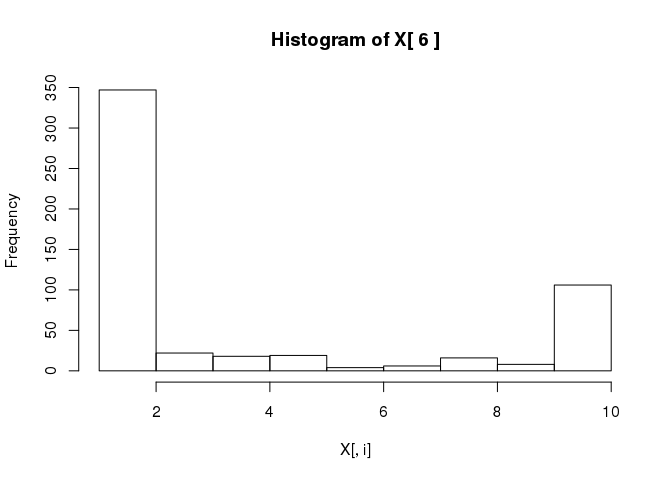

# Breast Cancer Wisconsin

---

#### Load our libraries

```r
library(mlbench)
library(R.matlab)
```

```
## R.matlab v3.6.1 (2016-10-19) successfully loaded. See ?R.matlab for help.
```

```
## 
## Attaching package: 'R.matlab'
```

```
## The following objects are masked from 'package:base':
## 
##     getOption, isOpen
```

```r
library(caTools)
source("estimate_gaussian.r")
source("multivariate_gaussian.r")
```

```
## Loading required package: bitops
```

```r
source("select_threshold.r")
```

---

#### Load the dataset

```r
# Wisconsin Breast Cancer Database
# https://archive.ics.uci.edu/ml/datasets/Breast+Cancer+Wisconsin+%28Original%29
# NOTE: We define the malignant class (outliers) as 1
data(BreastCancer)
breast = data.matrix(BreastCancer) # Convert data frame to a matrix
breast = breast[complete.cases(breast),] # Remove NA values
breast[, c('Class')] = breast[, c('Class')] == 2 # NOTE: benign = 1, malignant = 2
```

---

#### Split the dataset into training and cross-validation sets

```r
split = sample.split(breast[,c('Class')], SplitRatio = 0.2)
train = subset(breast, split == FALSE)
val = subset(breast, split == TRUE)
```

---

#### Isolate labels and features

```r
# Labels
y = train[, c('Class')]
yval = val[, c('Class')]

# Features
drop_columns = c('Id', 'Class')
X = train[, !(names(BreastCancer) %in% drop_columns)]
Xval = val[, !(names(BreastCancer) %in% drop_columns)]
```

---

#### Histogram of features

```r
for (i in 1:dim(X)[2]) {
  hist(X[,i], main = paste("Histogram of X[", i, "]"))
}
```

<!-- --><!-- --><!-- --><!-- --><!-- --><!-- --><!-- --><!-- --><!-- -->

---

#### Detect anomalies!

```r
g = estimate_gaussian(X)
p = multivariate_gaussian(X, g$mu, g$sigma)
pval = multivariate_gaussian(Xval, g$mu, g$sigma)
t = select_threshold(yval, pval)
```

---

#### How'd we do?

```r
accuracy = (p < t$epsilon) == (y == 1)
print(sum(accuracy == 1) / length(accuracy))
```

```
## [1] 0.8992674
```
